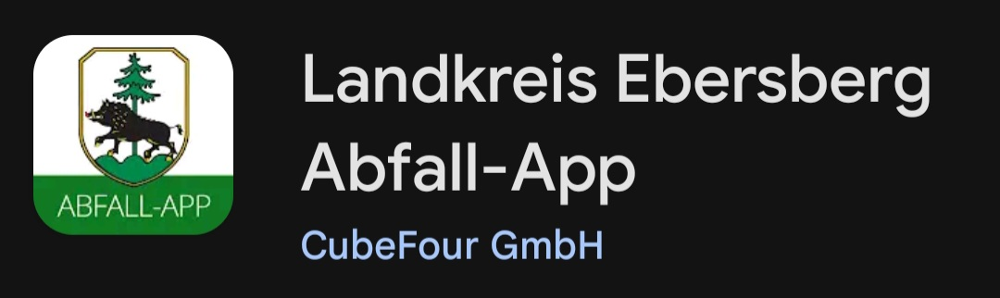

# Inhaltsverzeichnis
- [Inhaltsverzeichnis](#inhaltsverzeichnis)
- [Wichtiger Hinweis](#wichtiger-hinweis)
- [Einleitung](#einleitung)
- [Abfallkalender von Mankei (Alexa Skill)](#abfallkalender-von-mankei-alexa-skill)

# Wichtiger Hinweis

Seit etwa Mitte 2025 besteht die Möglichkeit, die Termine des Abfallkalenders über die Abfall-App des Landkreises Ebersberg zu beziehen. In dieser App kann, nach dem Einrichten des Profils (wichtig sind hier Wohnort und Straße), der Download eines iCalendar im Format einer ICS-Datei durchgeführt werden. Diese ICS-Datei kann dann direkt weiterverwendet werden, z. B. im [Abfallkalender von Mankei (Alexa Skill)](#abfallkalender-von-mankei-alexa-skill).

Die App kann beispielsweise aus dem Google Play Store oder dem Apple App Store installiert werden.

https://portal.awido.de/Customer/ebe/App.aspx


Als Beispiel hier die Abfall-App des Landkreises Ebersberg im Google Play Store:



Mit der Einführung dieser Funktionalität ist mein Abfallkalender in Form des Visual-Basic-Codes zur Generierung der Kalenderdaten eigentlich nicht mehr erforderlich.

Aus Neugier habe ich dennoch für das Jahr 2026 die notwendigen Anpassungen in der Excel-Datei vorgenommen und festgestellt, dass in den für mich gültigen Abfallkalenderdaten (ID-500) mehrere Fehler in der ICS-Datei aus der Abfall-App enthalten sind, die im Zusammenhang mit den Feiertagsverschiebungen stehen. Aus diesem Grund habe ich die Textdateien für das gesamte Gemeindegebiet (zum Vergleich oder als alternative Referenz zur ICS-Datei) noch einmal komplett generiert und im Repository bereitgestellt.

# Einleitung

Dieser Abfallkalender ist für die folgende Gemeinde im Landkreis Ebersberg gültig.

```
85570 Markt Schwaben
```


Er basiert auf dem von der Gemeinde bereitgestellten PDF-Dokument, das auch unter folgender Webadresse verfügbar ist:

https://www.markt-schwaben.de/Abfuhrkalender

Die relevanten Daten zu den Abholterminen dieses PDFs wurden in eine Excel-Datei importiert und mittels eines VBA-Codes können daraus Müllabfuhrkalender für das gesamte Gemeindegebiet erstellt werden.

Folgende Abholtermine werden aktuell berücksichtigt:
- Restmüll
- Biomüll
- Gelber Sack
- Gartenabfälle

Die generierten Abfallkalender werden in den jeweiligen Jahreszahl-spezifischen Unterverzeichnissen als Textdateien zur Verfügung gestellt. Um den für eine Straße relevanten Abfallkalender zu identifizieren, kann im zum entsprechenden Jahr gehörenden Unterverzeichnis nach dem Straßennamen in allen Textdateien gesucht werden.

Die Abholtermine sind in der entsprechenden Textdatei im komma-separierten Format aufgelistet und können zur Weiterverarbeitung in das bevorzugte Programm oder System importiert werden, zum Beispiel zur Erstellung von Terminen bzw. Terminserien (zur Erinnerung an die Abholtermine über das Jahr).

# Abfallkalender von Mankei (Alexa Skill)

Eine Platform, welche alle meine persönlichen Anforderungen (innerhalb eines Alexa basierten Eco-Systems) perfekt erfüllt und welche ich daher seit einigen Jahren sehr gerne nutze, ist der Abfallkalender Alexa-Skill von Mankei. Alle Informationen zu diesem Skill sind unter folgender Web-Adresse verfügbar:

https://www.mankei.eu/abfallkalender/search_ical.php

Der Inhalt der generierten Textdateien kann auf der Web-Anwendung von Mankei durch Copy-and-Paste direkt eingefügt werden.
